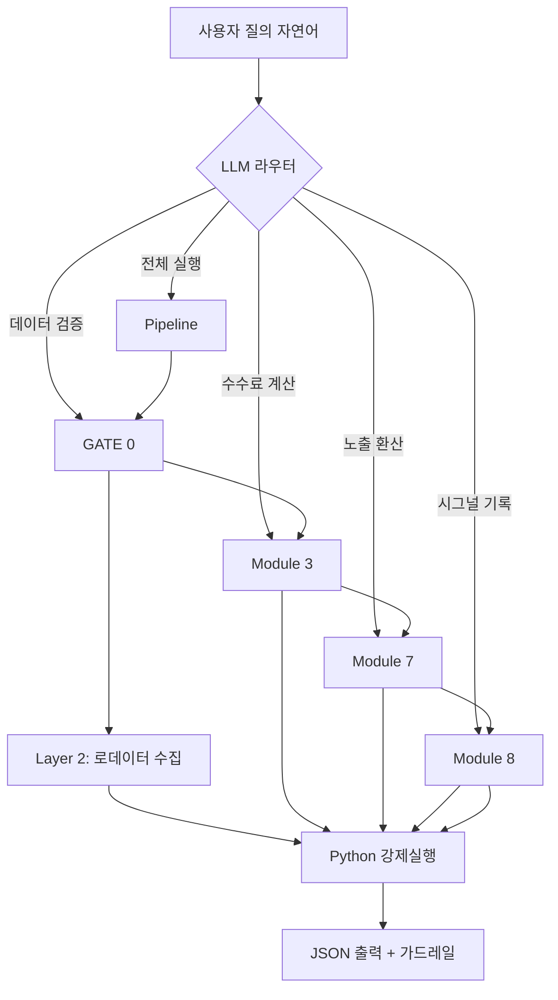

# PARKSY FX Engine v3.0 — 100% 기술 명세서

## 1. MCP 모델 아키텍처

```
등록: ~/.claude.json → "dollar-system-mcp"
구동: python3 /home/dtsli/OrbitPrompt/dollar-system-mcp/mcp/server.py
프레임워크: FastMCP (SSE/stdin-transport 자동)
```

**계층 구조**:
```
Layer 0: LLM 자연어 → 의도 분류 (계산 금지, 라우팅만)
Layer 1: GATE 0 — 데이터 출처 검증 (우회 불가, 하드코딩)
Layer 2: Module 3/7 — 헤게모니 수수료 + 듀얼유닛 환산
Layer 3: Module 8 — 시그널 로거 (기록전용, 매매금지)
Layer 4: 출력 — JSON 고정, 자연어 숫자추정 금지
```

**v2.2 레거시 9개 + v3.0 신규 6개 = 총 15개 툴**

---

## 2. 핵심 논리값 (Core Equations)

### 2.1 헤게모니 수수료율 (Module 3)
```
hegemonic_fee_rate = (current_rate - baseline_rate) / baseline_rate × 100
real_received      = nominal_surplus / (1 + hegemonic_fee_rate/100)
fee_amount         = nominal_surplus - real_received
```

베이스라인: KRW=1240, JPY=128, TWD=29.2 (2022H1 = Fed 금리인상 시작점)

### 2.2 듀얼 유닛 환산 (Module 7)
```
USD_equiv(t)  = Σ[i] Exposure_i(t) / FX_to_USD_i(t)
GOLD_equiv(t) = USD_equiv(t) / GOLD_price_USD(t)
```

N개 통화 → 항상 2개 유닛 출력. 표본 수(N)와 무관.

### 2.3 GATE 0 5단계 점수
```
confidence = source_tier × benford_factor × regime_factor × incentive_factor × consensus
gate_status: confidence ≥ 0.55 → PASS, ≥ 0.35 → WARNING, < 0.35 → BLOCK
```

### 2.4 시그널 강도
```
signal_strength = Σ[trigger_i × weight_i] (0.0~1.0, capped)
accumulation_threshold: 8회 미만 = 자본투입 금지 (허생전 프로토콜)
```

---

## 3. 설정과 가정 (Settings & Assumptions)

| 항목 | 값 | 근거 |
|------|-----|------|
| 베이스라인 시작점 | 2022H1 | Fed 금리인상 사이클 시작 |
| KRW 기준환율 | 1,240 | 2022H1 평균 |
| JPY 기준환율 | 128 | 2022H1 평균 |
| TWD 기준환율 | 29.2 | 2022H1 평균 |
| GATE 0 PASS 임계 | confidence ≥ 0.55 | 보수적 설정 |
| GATE 0 BLOCK 임계 | confidence < 0.35 | 데이터 배제 기준 |
| 시그널 최소누적 | 8회 | 허생전 프로토콜 |
| Benford 최소표본 | 20개 | 통계적 유의성 |
| Regime Change Z | 2.5σ | 3-window 평균 대비 |
| 경상흑자 테이블 | 정적(annual) | 한국은행/BOJ/CBC 확정치 |

**가정**:
- 2022H1 이후 구조적 이탈 없음 (ε항 내에서 관리)
- yfinance 실시간 데이터는 GATE 0에서 "1차 출처"로 분류
- 금 가격 = GLD ETF (유동성 가장 높음)
- Benford 이탈 = 조작 증거 아니라 추가검증 트리거

---

## 4. 알고리즘 (Execution Flow)

### 4.1 GATE 0 실행 순서
```
Step 1: 출처 계보 (URL 도메인 분석 → tier 분류)
Step 2: Benford's Law (첫째자리 분포 → 카이제곱 이탈도)
Step 3: Regime Change (최근 N값의 Z-score 이탈)
Step 4: Issuer Incentive (키워드 기반 이해상충 탐지)
Step 5: Cross-Source Consensus (복수출처 변동계수)
→ 역용 시그널: 2개 이상 경고면 "지표 주목도 상승"
```

### 4.2 파이프라인 실행 순서
```
fx_pipeline(currency="KRW"):
  1. yfetch USDKRW=X → current_rate
  2. GATE 0(current_rate) → PASS/WARNING/BLOCK
  3. Module 3(current_rate, surplus) → hegemonic_fee
  4. Module 7(exposures, gold_price) → dual_unit (옵션)
  5. Module 8(signal_record) → log_append (옵션)
  6. return {guardrails, timestamp, all_modules}
```

### 4.3 시그널 판정 로직
```
if hegemonic_fee_rate > 15%:   → dsi_stress (max 0.20)
if gate_status == "WARNING":   → +0.15
if regime_change_flag:         → +0.20
→ 총합 cap 1.0 → signal_log.json 저장
→ cumulative < 8회 → 자본투입 금지
```

---

## 5. 프로그램 엔진 모델링

### 5.1 데이터 흐름
```
외부 데이터 (yfinance/URL)
    ↓
[GATE 0] — 출처검증 → 신뢰도 가중치 조정
    ↓
[Module 3] — 환율 + 경상흑자 → 헤게모니 수수료
    ↓
[Module 7] — N개 통화노출 → USD_equiv + GOLD_equiv
    ↓
[Module 8] — 시그널 로거 → signal_log.json 누적
    ↓
[JSON 출력] — guardrails + timestamp + all_results
```

### 5.2 모듈 간 인터페이스
```
모든 모듈 입출력 = dict (JSON serializable)
GATE 0 confidence → Module 7 exposure weight 조정
Module 3 fee_rate → Module 8 signal_type 결정
Module 8 저장소   → mcp/data/signal_log.json
```

### 5.3 가드레일 (Hardcoded, 우회 불가)
```
1. 사후분석 — 예측 아님
2. 트랙 2(FX/금 DCA) = 복리 컴파운드 트랙 — 베타헤지/손실방어용 아님
3. 레버리지 금지 — 현물 자산 매집 기준
4. 8회 미만 자본투입 금지
5. GATE 0 우회 금지 — 모든 외부데이터 통과 필수
6. End-Station=FX ≠ 로데이터 무시
   → 산업/경상수지 데이터 = 직접 베팅 대상(X)
                       = 환율 모델 입력 검증 사료(O)
```

---

## 6. 직관적 사용법 (MCP 툴 호출)

### 6.1 가장 빠른 진입
```
"원화 헤게모니 수수료 얼마야?"
→ hegemonic_fee(currency="KRW") 자동 호출
```

### 6.2 풀 진단
```
"FX Engine 풀 파이프라인 돌려줘, 원화 노출 1억 기준"
→ fx_pipeline(currency="KRW", exposures=[...])
→ GATE 0 → Fee → Dual → Signal 전부 출력
```

### 6.3 데이터 검증
```
"이 데이터 신뢰할 수 있어?" (URL 동봉 시)
→ gate0_check(data_point_name, source_url)
→ PASS/WARNING/BLOCK + confidence + 역용시그널
```

### 6.4 통화 노출 통합
```
"내 원화 1억, 엔화 500만 엔 금으로 환산해줘"
→ dual_unit_reduce(exposures=[...])
→ USD_equiv + GOLD_equiv + 개별 비중
```

### 6.5 시그널 현황
```
"시그널 몇 개 쌓였어?"
→ signal_log(action="stats")
→ 누적 2회 / 8회 필요 / 자본투입:불가
```

---

## 7. 효과성 (Effectiveness)

### 7.1 정보비율
```
개별종목 분석: N개 × 산업동향 × 실적시즌 × 거시 = O(N³)
환율 단일 변수: 1개 × GATE 0 검증 = O(1)

정보비율 = 얻은 정보 / 들인 노력 → 환율이 압도적
```

### 7.2 관리비용 절감
- 개별주식 리서치: 주 5~10시간 (종목당)
- 환율 모니터링: 주 5~10분 (1개 변수)
- 비용 차이: 1/60 수준

### 7.3 복리 누적 메커니즘
```
헤게모니 수수료 인지 → DCA 기반 USD/금 매집 → 
시간이 갈수록 누적 우위 (DCA의 수학적 효과) → 
트랙 1(IP/콘텐츠)과 성격이 다른 독립적 수익 트랙
```

### 7.4 한계
- 단기 타이밍 불가능 — 분기~연간 단위 설계
- 단기 타이밍 불가능 — 분기~연간 단위 설계
- GATE 0 검증에도 데이터 품질 한계 존재
- 금 가격/미국채 금리 변동은 별도 리스크

---

## 8. 전체 구조 다이어그램 (Mermaid)



---

**버전**: v3.0.0 | **최종 업데이트**: 2026.06.30
**모듈 수**: 4 (GATE 0 / Fee / Dual-Unit / Signal) | **MCP 툴**: 15개
**핵심 원칙**: LLM은 숫자를 추정하지 않는다 — Python이 계산한다.
**가드레일 개수**: 6개 (하드코딩, 우회 불가)
